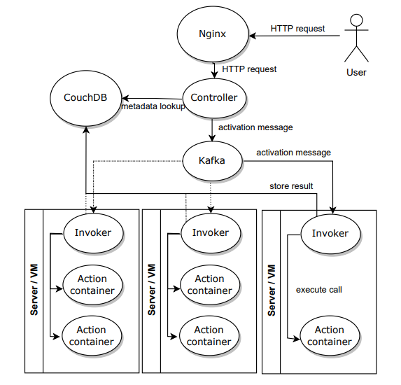
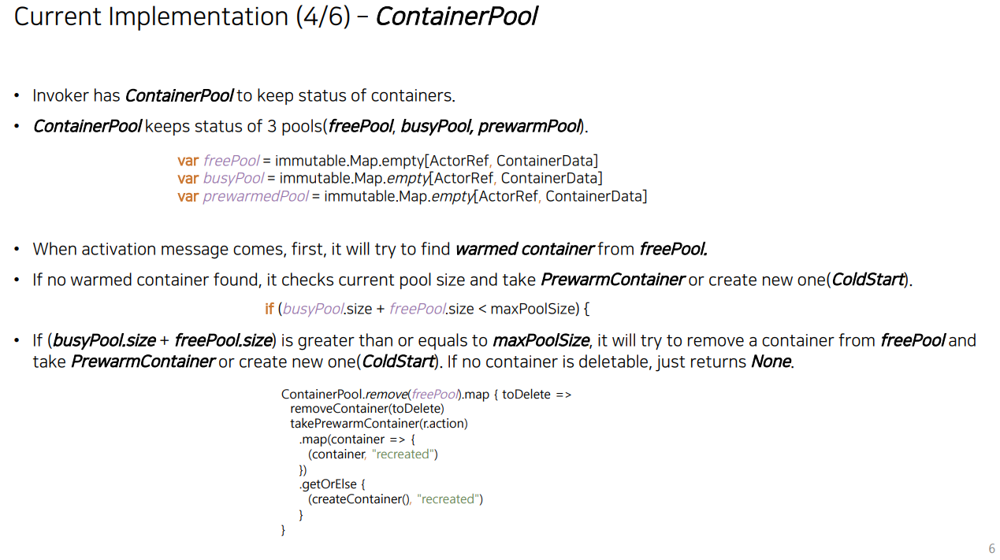
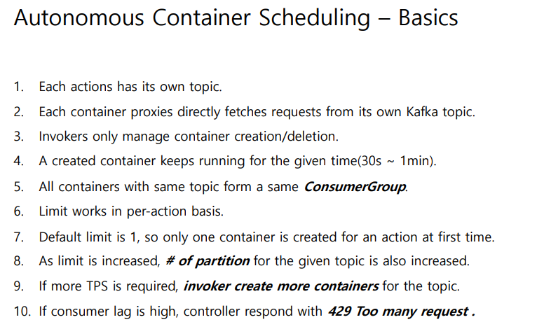
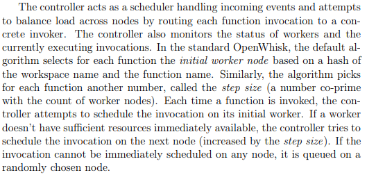

# OpenWhisk的调度策略

## 1. OpenWhisk总述

Apache OpenWhisk 是一个开源的分布式无服务器平台，可以执行函数来响应各种规模的事件。项目的GitHub地址为：```https://github.com/apache/openwhisk```。该平台使用 Docker 容器管理基础设施、服务器和扩展。OpenWhisk的核心架构如下：



开发者基于OpenWhisk开发的项目中的代码和数据储持久化存储于[Apache CouchDB](https://couchdb.apache.org/)中。

用户向Nginx发送HTTP请求，Nginx进行转发。每个 Invoker 是 OpenWhisk 平台中的一个独立服务进程，负责实际执行动作容器（Action container）。Action container基于Docker开发。OpenWhisk控制器（Controller）根据Nginx转发的HTTP内容，选择一个Invoker所维护的Action container执行开发者编写的函数（Function），这个过程被称为OpenWhisk的调度。


## 2. OpenWhisk容器池

OpenWhisk维护三个容器池，分别为空闲池（freePool）、忙碌池（busyPool）和预热池（prewarmPool）<sup><a href="#ref1">[1]</a></sup>。



### 2.1 预热池

预热池（prewarmPool）是包含已加载对应运行环境（如 Node.js、Python 等 runtime）的容器集合，这些容器尚未绑定具体函数。

预热池的相关内容由用户配置。配置文件路径为```core/invoker/src/main/resources/application.conf[62-76]```，配置内容如下：

```
container-pool {
    user-memory: 1024 m
    concurrent-peek-factor: 0.5 #factor used to limit message peeking: 0 < factor <= 1.0 - larger number improves concurrent processing, but increases risk of message loss during invoker crash
    pekko-client:  false # if true, use PoolingContainerClient for HTTP from invoker to action container (otherwise use ApacheBlockingContainerClient)
    prewarm-expiration-check-init-delay: 10 minute # the init delay time for the first check
    prewarm-expiration-check-interval: 10 minute # period to check for prewarm expiration
    prewarm-expiration-check-interval-variance: 10 seconds # varies expiration across invokers to avoid many concurrent expirations
    prewarm-expiration-limit: 100 # number of prewarms to expire in one expiration cycle (remaining expired will be considered for expiration in next cycle)
    prewarm-max-retry-limit: 5 # max subsequent retry limit to create prewarm containers
    prewarm-promotion: false # if true, action can take prewarm container which has bigger memory
    memory-sync-interval: 1 second # period to sync memory info to etcd
    batch-deletion-size: 10 # batch size for removing containers when disable invoker, too big value may cause docker/k8s overload
    # optional setting to specify the total allocatable cpus for all action containers, each container will get a fraction of this proportional to its allocated memory to limit the cpu
    # user-cpus: 1
  }
```

### 2.2 忙碌池与空闲池

忙碌池是正在执行过某个Function的Action container的集合。当 Invoker 从预热池中选取一个合适的容器并完成专用化（specialization）后，该容器被移入忙碌池（busyPool）。同时，这个容器中将保存该函数的环境、代码、数据等信息，该容器将与该函数绑定，自此该容器将仅能运行该函数。运行结束后，该容器将会转移至空闲池。


## 3. OpenWhisk调度流程

### 3.1 调度流程总述

1. 用户调用一个 action请求首先到达 Controller。

2. Controller 调度

   - 通过某种方法选择一个 invoker（详见3.2）。

   - Controller 把请求（activation message）放到 Kafka 队列。

3. Invoker 接收激活消息

   - Invoker 订阅自己的 Kafka topic。

   - 收到 activation 后，进入内部的 `ContainerPool` 流程：
     - 如果在 `freePool` 中找到该 action 的 warm 容器 → 直接复用。
     - 否则从 `prewarmPool` 拿出一个 stem-cell 容器并 specialize（注入代码）。
     - 若仍无可用容器 → cold start 新建一个容器。

4. 执行完成后

   - 容器执行完函数后被标记为 idle → 放入 `freePool`。

   - 或因 timeout、内存不足等被销毁<sup><a href="#ref1">[1]</a></sup>。



### 3.2 invoker选择策略

Controller选择invoker的方式是为每个函数计算哈希值并确定一个步长，步长与invoker的数量互质。最初Controller以函数的哈希值确认其初始invoker（homeInvoker），如果该Invoker无多余资源，则Controller根据步长将选择下一个Invoker<sup><a href="#ref2">[2]</a></sup>。该方法保证相同函数尽量调度到相同 invoker，增加缓存命中率，减少冷启动。



Invoker详细的选择策略可以通过代码```https://github.com/apache/openwhisk/blob/master/core/controller/src/main/scala/org/apache/openwhisk/core/loadBalancer/ShardingContainerPoolBalancer.scala```查看。

___

参考资料：

<div><a name="ref1"></a>[1] Apache OpenWhisk Developers. (2018, May 25). OpenWhisk scheduling proposal [Technical design document]. Apache Software Foundation. Retrieved from https://cwiki.apache.org/confluence/download/attachments/85466849/OW_new_scheduling_proposal_180525.pdf</div>

<div><a name="ref2"></a>[2] Zuk, P. (2023). Resource allocation methods for serverless cloud computing platforms[PhD dissertation]. University of Warsaw, Faculty of Mathematics, Informatics and Mechanics.</div>